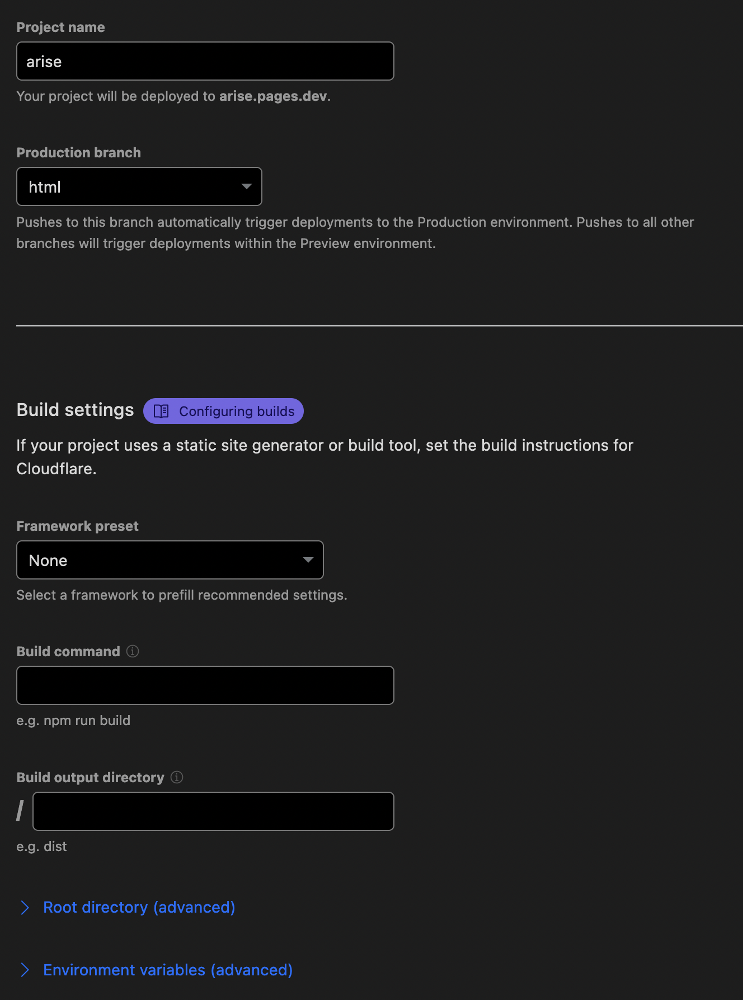
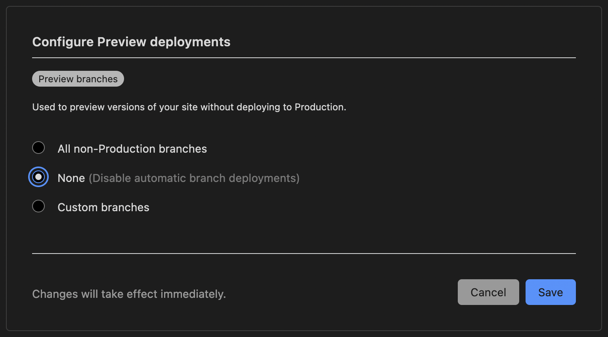

# Deploying to Cloudflare Pages

This guide assumes that you have completed steps 1-3 from [Getting Started](../README.md) and have a successfully build website in your `html` branch.

1. Navigate to your [Cloudflare Dashboard](https://dash.cloudflare.com) and click **Pages** in the sidebar.
2. Click **Create a project** > **Connect to Git**.
3. Add your account and select your repository. Click **Begin setup** to proceed.
4. Name your project whatever you'd like and select `html` as your **Production branch**. Leave all the optional **Build settings** blank-- we don't need any of these.

5. Click **Save and Deploy**
6. **IMPORTANT**: Click **Pages** in the sidebar and click on your site.
7. Click **Settings**.
8. Click **Builds & deployments**.
9. Click **Configure Preview deployments**.
10. Click **None** and **Save**. 

As of this writing, if you don't IMMEDIATELY disable preview deployments, Cloudflare will automatically generate live externally-accessible "preview" URLs for every single branch in your website repo (even if your repo is private). Based on how Arise works, this will not only result in previews that are broken and do not work, but it will disclose literally everything in your repo including potentially WIP pages if your repo is private. To put a cherry on top, after preview deployments have been build for a branch, you cannot delete them without deleting and re-adding your entire damn website. What a stupid-ass system.

Anyway, rants aside, your site should now be up and running on Cloudflare Pages! Congrats! If you'd like to use a custom domain, please review Cloudflare's [custom domains guide](https://developers.cloudflare.com/pages/platform/custom-domains/) as that is outside of the scope of this documentation.
