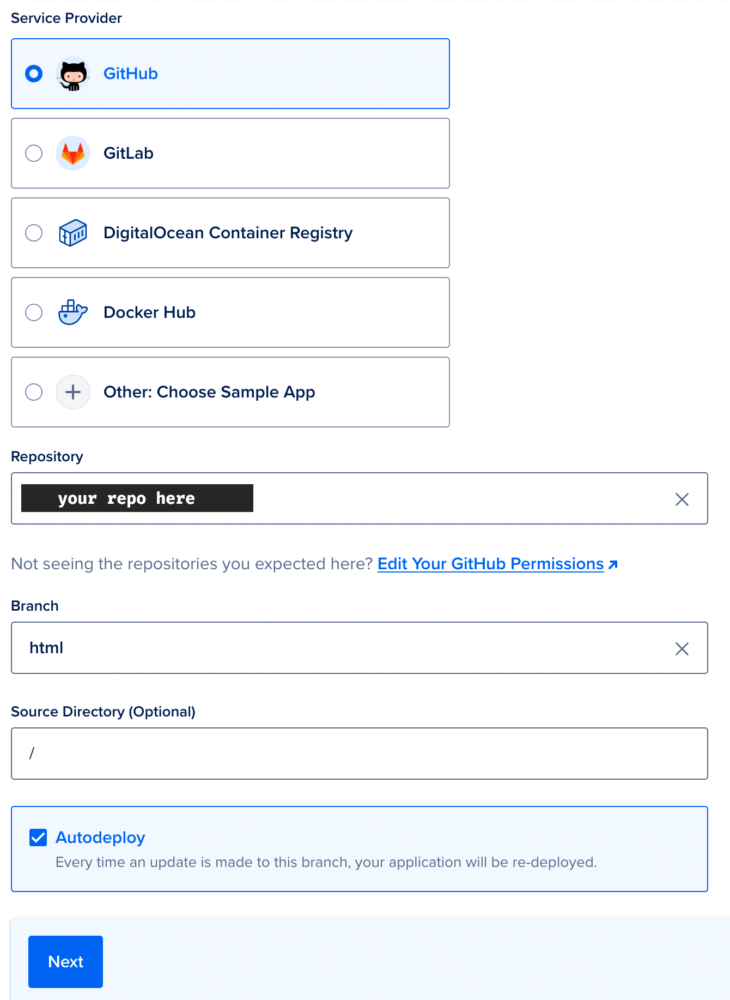

# Deploying to DigitalOcean

This guide assumes that you have completed steps 1-3 from [Getting Started](../README.md) and have a successfully build website in your `html` branch.

1. Navigate to the [Apps](https://cloud.digitalocean.com/apps) pane in your DigitalOcean account.
2. Click **Create App**.
2. Select **GitHub** as your source, select your repository, and define `html` as your target branch. Leave `/` as your source directory. Leave the box checked next to **Autodeploy** so that your site will automatically pull new updates whenever you push a commit to `main` in your Arise site repo on GitHub. Hit **Next** to proceed. 

3. Click **Skip to Review** to skip past all the other optional settings-- we don't need any of them.
4. Click **Create Resources**.

Congrats! Your Arise website is now live on DigitalOcean. If you'd like to use a custom domain, please review DigitalOcean's [custom domains guide](https://docs.digitalocean.com/products/app-platform/how-to/manage-domains/) as that is outside of the scope of this documentation.
